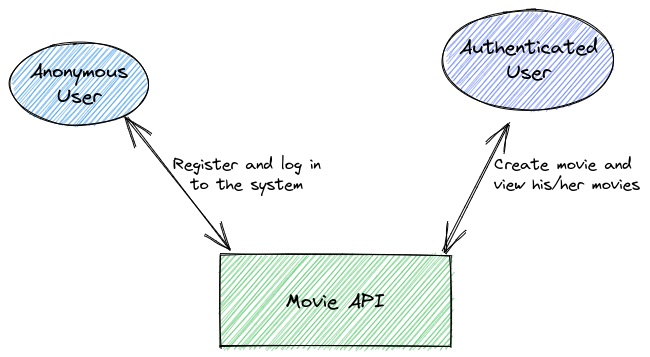
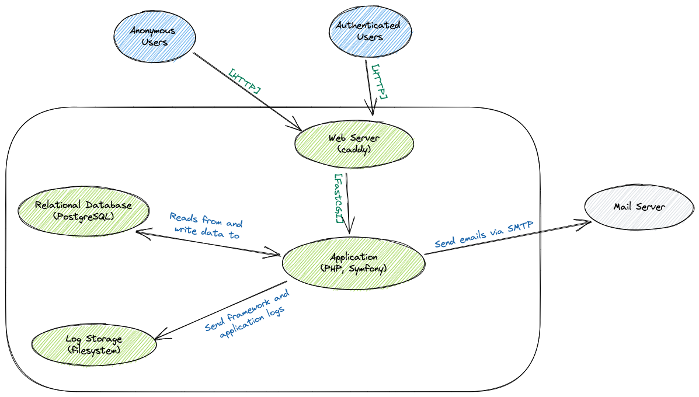
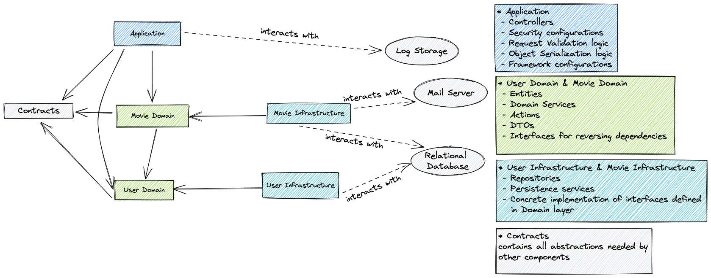

# Movie API


This repository is my take-home project for interview process at ### company.

## Requirements
Before setting up the project you need to make sure these tools are installed on your environment:
 - Docker
 - Docker Compose
 - Make

## Getting Started
To set up the project run below commands:
```shell
make setup
make migrate
```

## Running Tests
Run below command to run tests:
```shell
make test
```

## Architecture

### System level point of view
The application is an API with two set of users:
 - Anonymous users: can only register to the system and then log
 - Authenticated users: users after logging in can create movies and show their created movies



### Container level point of view
The system contains below containers:
 - Web server, I chose Caddy as webserver just because it is very simple and fast to configure for
   development environment.
 - Application, the application is a php application that is based on Symfony 5.4 framework
 - Database
 - Log storage, for simplicity the log storage is filesystem that is default storage of the chosen framework
 - Mail Server, mail server can be considered as an external service but for development purpose I set up mailcatcher
    in development environment



### Application's components
I tried to follow some of DDD and Clean Architecture patterns, so I decided to decouple
business logic from infrastructure related stuff (dealing with database, sending email, ...).
As you can see in below diagram I have these components: 
 - Contracts
 - User Domain
 - Movie Domain
 - Application
 - User Infrastructure
 - Domain Infrastructure



#### Contracts
The contracts component is inside `src/Contract/` directory. The purpose of having this component
is to contain all interfaces that can be shared between different components and also doesn't belong to
any of them. For example, I created a `DTOInterface` and placed that inside the contract component and used
that inside `User Domain`, `Movie Domain` and `Application` components.

### User Domain
`User Domain` component is inside `src/Domain/User` directory and contains all business logic related to users.
This component is not dependent to any other component and only contains pure PHP code. I tried to write 
framework-agnostic code inside this component. (there is some exceptions that can be fixed as an 
improvement.)

There are following set of classes inside this component:
 - Entity classes: entities are domain concepts that have a unique identity in the problem domain 
 - Action classes: actions are the only way other components can call this component. It is not allowed to call any 
    domain service directly. You can see that actions only calls domains services and repository interfaces in order to
    get done a specific use case.
 - Service: Domains services do operations on entities. As you can see there are some interfaces inside the `Service` 
   directory. I defined These interfaces as well as repository interfaces to reverse dependency between domain component
   and infrastructure component.

### Movie Domain
This is similar to `User Domain`. the only thing is that `Movie Domain` depends on the `User Domain`.

`Movie Domain` component is inside `src/Domain/Movie` directory.

### User Infrastructure
Every concrete implementation for user related details like dealing with database and sending email are in this 
component.

`User Infrastructure` component is inside `src/Infrastructure/User` directory.

### Movie Infrastructure
This is similar to `User Infrastructure` component. 

`Movie Infrastructure` component is inside `src/Infrastructure/Movie` directory.


### Application Component
Every code other than above components can be considered as `Application Component`. 
This component contains controllers, security configurations, request validation logics, object serialization logics
and all framework related stuff.

## Testing
I have written different types of tests:

- Application tests: All controller tests are application tests, these tests send request to existing endpoints and test
  the behavior of the endpoints without mocking anything.
- Integration tests: I wrote integration tests mostly for infrastructure components. I tested repositories, persistence
  logic with integration tests.
- Unit tests: All tests that I have written for Domain components are unit tests. These tests don't interact with 
  database, don't send emails and are isolated from other components. Note that I wrote unit tests for actions only 
  and wrote no test for domain services. Because I prefer to test behaviors that test everything. And since behaviors of 
  each component are inside actions I tested only actions, therefore in order to cover domain services in tests I didn't
  mock them. So only interfaces are being mocked


## Improvements
 - Move doctrine annotations to xml files in order to make Domain components 100% framework-agnostic.
 - Add more validation on incoming data.
 - Use CQRS pattern
 - Remove business logic from MovieVoter class to an action inside of Movie Domain component and then call that action 
   inside the voter
 - Improve handling request and response formats. For example It would be better if we sent proper error for requests that expect
   xml response or requests that are sending xml
 - Token authentication is very simple and can be replaced with JWT authentication
 - Add createdAt and updatedAt fields to entities.
